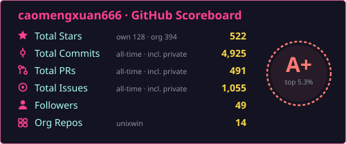
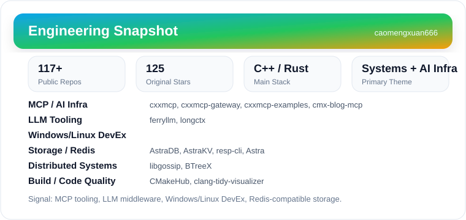
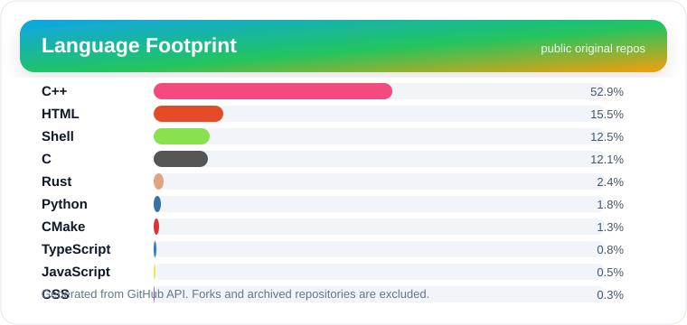

  

  
  
  
  

  

## GitHub Scoreboard

  

  Stars and contributions across <a href="https://github.com/unixwin">unixwin</a> + personal repos · rank algorithm from <a href="https://github.com/anuraghazra/github-readme-stats">github-readme-stats</a> · refreshed daily by GitHub Actions

## Hi, I'm 曹梦轩

Chaohu University CS student. I build systems software in C++ and Rust — currently the maintainer of **niubash**, a native GNU Bash runtime for Windows, and the engineering line around it: the rubash scripting engine, the WinuxCmd command set, the WPM package manager, and the oh-my-niu framework.

Beyond the shell, my work spans connected product lines rather than isolated demos: MCP infrastructure with a conformance-tested C++ SDK, Redis-compatible storage engines, LLM protocol middleware, and performance-oriented command-line utilities.

## Links

  
  
  
  

## Featured Work

| Project | Focus | Stack |
| --- | --- | --- |
| [niubash](https://github.com/unixwin/niubash) | Native GNU Bash runtime for Windows, with the rubash engine and WPM package manager. | C, C++, Rust |
| [WinuxCmd](https://github.com/unixwin/WinuxCmd) | Native Windows implementation of Linux-style commands. | C++, CMake, PowerShell |
| [cxxmcp](https://github.com/caomengxuan666/cxxmcp) | Conformance-tested C++17 SDK for Model Context Protocol servers and clients. | C++17, CMake, JSON-RPC |
| [AstraDB](https://github.com/caomengxuan666/AstraDB) | High-performance Redis-compatible database written in modern C++23. | C++23, Redis protocol |
| [ferryllm](https://github.com/caomengxuan666/ferryllm) | Universal LLM protocol middleware for OpenAI, Anthropic, Claude Code, and compatible backends. | Rust, TypeScript |
| [libgossip](https://github.com/caomengxuan666/libgossip) | C++17 gossip protocol implementation for decentralized distributed systems. | C++17, networking |

## What I Build

| Direction | Projects | Notes |
| --- | --- | --- |
| Shell & Windows DevEx ([unixwin](https://github.com/unixwin)) | [niubash](https://github.com/unixwin/niubash), [rubash](https://github.com/unixwin/rubash), [WinuxCmd](https://github.com/unixwin/WinuxCmd), [oh-my-niu](https://github.com/unixwin/oh-my-niu), [wpm-source](https://github.com/unixwin/wpm-source), [winuxcmd-i18n](https://github.com/unixwin/winuxcmd-i18n) | Native bash runtime, scripting engine, command set, plugin framework, package manager, zh-CN docs. |
| MCP / AI infrastructure | [cxxmcp](https://github.com/caomengxuan666/cxxmcp), [cxxmcp-gateway](https://github.com/caomengxuan666/cxxmcp-gateway), [cxxmcp-examples](https://github.com/caomengxuan666/cxxmcp-examples), [cmx-blog-mcp](https://github.com/caomengxuan666/cmx-blog-mcp) | C++17 SDK, gateway/runtime tooling, examples, publishing automation. |
| LLM tooling | [ferryllm](https://github.com/caomengxuan666/ferryllm), [longctx](https://github.com/caomengxuan666/longctx) | Protocol middleware and long-context benchmark tooling. |
| Storage / Redis ecosystem | [AstraDB](https://github.com/caomengxuan666/AstraDB), [AstraKV](https://github.com/caomengxuan666/AstraKV), [resp-cli](https://github.com/caomengxuan666/resp-cli), [Astra](https://github.com/caomengxuan666/Astra) | Redis-compatible database, KV module, protocol client/server experiments. |
| Distributed systems | [libgossip](https://github.com/caomengxuan666/libgossip), [BTreeX](https://github.com/caomengxuan666/BTreeX) | Gossip protocol, data structures, systems primitives. |
| Build and code-quality tools | [CMakeHub](https://github.com/caomengxuan666/CMakeHub), [clang-tidy-visualizer](https://github.com/caomengxuan666/clang-tidy-visualizer) | CMake module management and C++ diagnostic visualization. |

## Currently Building

- `niubash`: pushing a native Windows GNU Bash runtime toward ZSH-grade ergonomics — own implementation, no ZLE compatibility layer.
- `cxxmcp`: a conformance-tested C++ SDK for MCP servers and clients, with `cxxmcp-gateway` runtime management around it.
- `ferryllm`: protocol middleware for LLM providers and OpenAI-compatible backends.
- `AstraDB`: a modern C++ Redis-compatible database.
- `oh-my-niu`: packs + plugins framework for the niubash ecosystem.

## Engineering Snapshot

  

  

## Technical Stack

  

| Layer | Tools, protocols, and topics |
| --- | --- |
| Core languages | C++17/20/23, Rust, C, Python, TypeScript, Lua |
| Systems programming | Networking, concurrency, storage engines, protocol design, CLI tooling, cross-platform runtime behavior |
| AI infrastructure | MCP, JSON-RPC, LLM gateways, OpenAI/Anthropic-compatible middleware, long-context benchmarking |
| Data and protocols | Redis/RESP, key-value engines, HTTP, Streamable HTTP, SSE, structured serialization |
| Build and packaging | CMake, CTest, GitHub Actions, Docker, vcpkg/Conan ecosystem, Shell, PowerShell |
| Code quality | Conformance tests, benchmark CLIs, clang-tidy tooling, diagnostics visualization, reproducible examples |
| Workflow | Linux, Windows, Neovim/Lua, VS Code extensions, automation scripts |

## Engineering Highlights

- Shipping `niubash` end to end: runtime, scripting engine, native command set, package manager, plugin framework, i18n, and distribution via winget / Scoop / WPM.
- Maintaining an MCP ecosystem in C++: SDK, gateway, examples, documentation, and publishing tools.
- Exploring Redis-compatible storage from multiple layers: database, KV module, RESP client, and server experiments.
- Writing LLM infrastructure beyond prompts: protocol middleware, long-context benchmarks, and agent-facing tooling.
- Comfortable moving between low-level C/C++, Rust services, build systems, shell automation, and editor/workflow tools.

  

